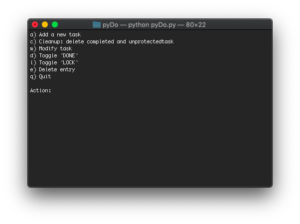
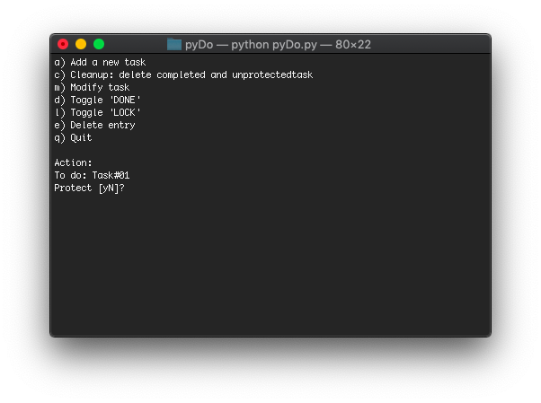
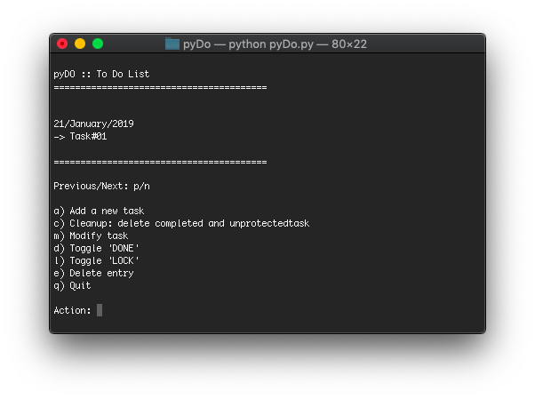
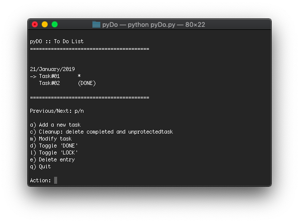

# pyDo

pyDo is a "to do" app based in this project https://teamtreehouse.com/community/todo-list-app-in-python

## Install
Clone or download this project and run:
'''python pyDo.py'''

### Packages needed
- python==3.x
- peewee==3.8.2
- readchar==2.0.1

## Usage

In your first run this app will create a new SQLite3 data base named pyDo_database.db and show you this 7 options:

a) Add a new task
c) Cleanup: delete completed and non-protected task
m) Modify task
d) Toggle 'DONE'
l) Toggle 'LOCK'
e) Delete entry
q) Quit

Also can you use n for move the cursor '->' to Next task or press p to select the previous task

so enjoy and be happy!

## Sample usage

- First usage:

- Add a new task:

- Summary task:

- Add other task:

